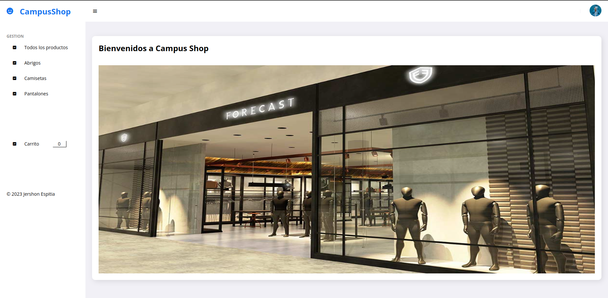
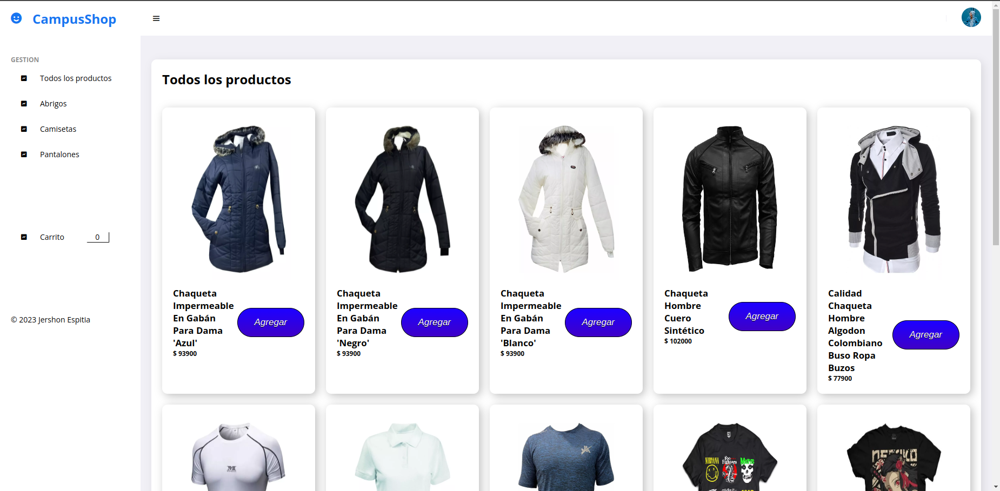
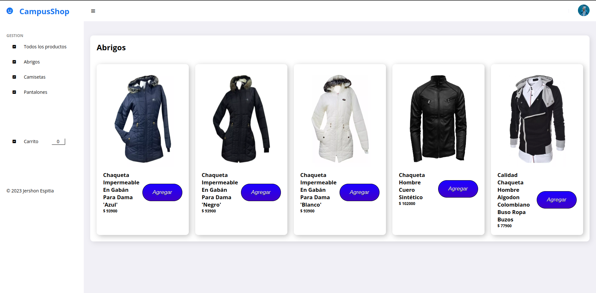
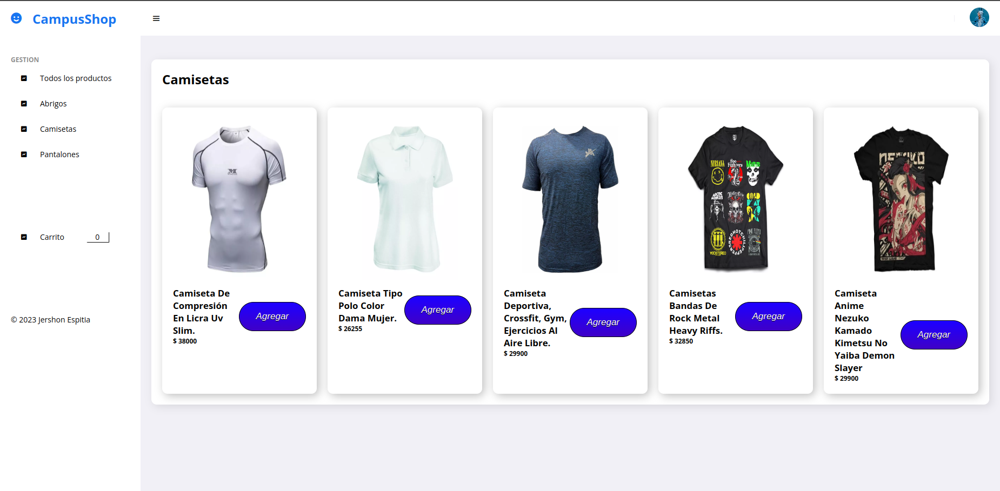
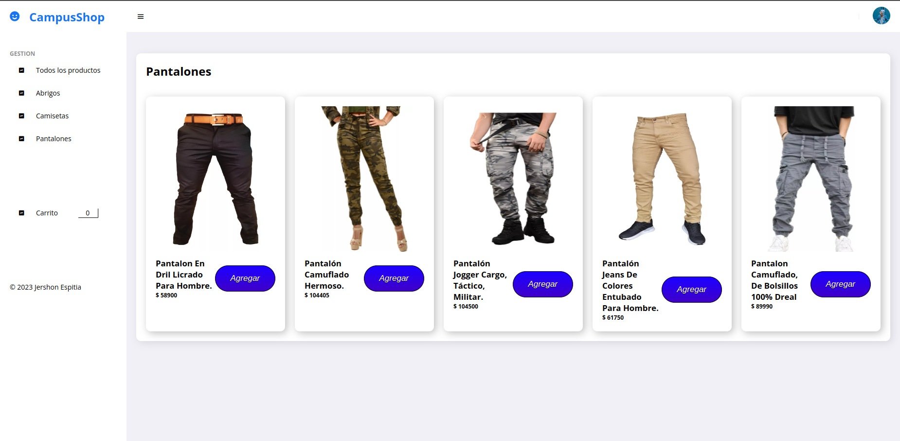
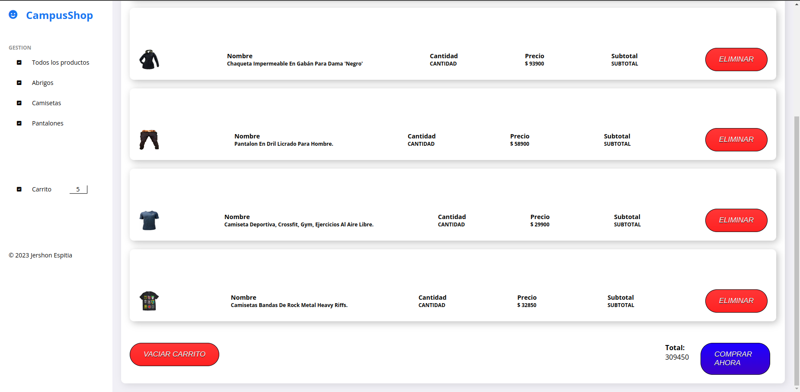

# Campus Shop

Este es un proyecto web simple que te permite realizar la compra de ropa como abrigos, camisetas y pantalones.

## Características

- Ver todos los productos disponibles.
- Filtrarlos por categoria (en los botones del lado izquierdo).
- Eliminar un producto especifico.
- Eliminar todo el carrito.
- Visualizar el carrito de compras con todos los productos agregados.
- Realizar la compra.

## Capturas de Pantalla

- Página principal.

- Todos los productos.

- Abrigos.

- Camisetas.

- Pantalones.

## Tecnologías Utilizadas

- HTML5
- CSS3
- JavaScript
- [Node](https://nodejs.org/es)

#

# Estructura del proyecto

- database
    * db.json
- imgs
    * abrigos.png
    * camisetas.png
    * carrito.png
    * pantalones.png
    * portada.png
    * todos.png
- storage
    * config.js
    * endPointsProducts.js
    * methods.js
- .gitignore
- app.js
- index.html
- main.js
- package-lock.json
- package.json
- README.md
- style.css

# Uso

NOTA: Para poder ejecutar el proyecto, debemos instalar algunas cosas primero en caso de no tenerlas:
1. Descargar la version 18.18.0 (https://nodejs.org/en)
2. Ejecutar el archivo descargado

Luego de tener instalado lo anterior:

1. Clona este repositorio en tu máquina local con el siguiente comando: `git clone https://github.com/JershonEspitia/CampusShop.git`

2. Abre la terminal y ejecuta el comando `npm i`

3. Ejecuta en la terminal `npm run dev` para arrancar el servidor

4. Abre el archivo `index.html` en tu navegador web para ejecutar la aplicación

5. Utiliza la aplicación para agregar productos a tu carrito.

#

# Como funciona la pagina

1. Al abrir el archivo `index.html` encontraremos nuestra pagina asi:

2. Luego podemos darle click a cualquier categoria y ver los productos:

3. Podemos agregar productos al carrito, dandole al boton de agregar:
   

4. En nuestro carrito podremos ver los productos agregados y podemos eliminarlos uno a uno, todos a la vez o realizar la compra.

# Contribución

¡Las contribuciones son bienvenidas! Si tienes ideas de mejoras o correcciones, no dudes en crear una solicitud de extracción (pull request) o informar sobre problemas (issues).

#

# Contacto
Si tienes alguna pregunta o comentario, no dudes en ponerte en contacto con el equipo de desarrollo.

# Autor

[By @JershonEspitia](https://github.com/JershonEspitia)